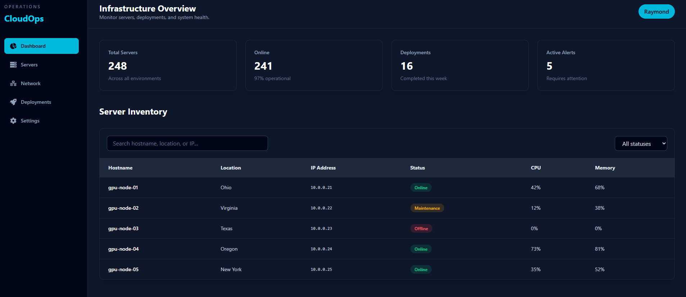
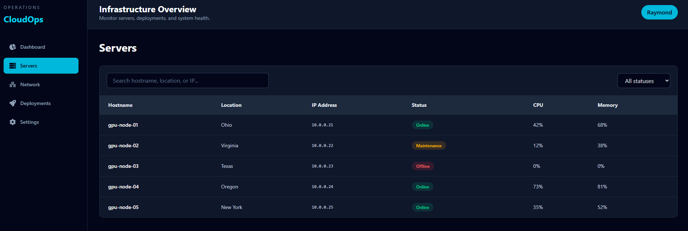
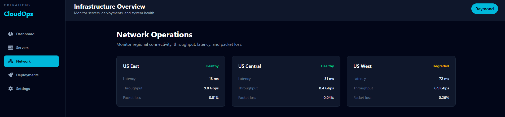
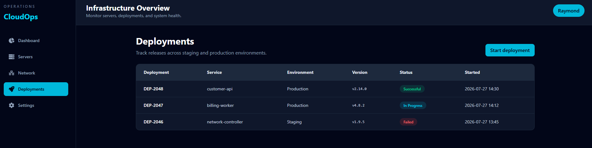
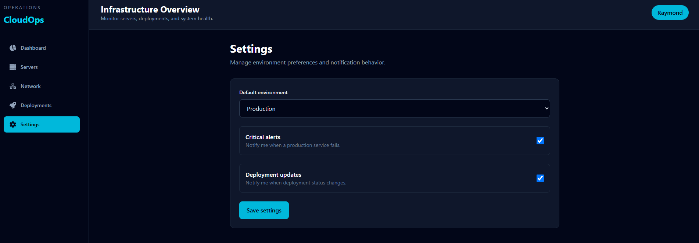

# ☁️ CloudOps Dashboard

> A modern enterprise cloud infrastructure dashboard built with **React**, **TypeScript**, **Tailwind CSS**, and **React Router**.


---

## 📖 Overview

CloudOps Dashboard is an enterprise-inspired web application that simulates the type of internal operations platform used by cloud providers and infrastructure engineering teams.

The application provides a centralized interface for monitoring servers, reviewing deployments, checking network health, and managing operational settings through a clean and responsive user interface.

This project was built to strengthen my frontend engineering skills while demonstrating modern React architecture and software engineering best practices.

---

## ✨ Features

- 📊 Infrastructure Dashboard
- 🖥️ Server Inventory
- 🔍 Search and Filtering
- 🟢 Status Badges
- 🚀 Deployment Tracking
- 🌐 Network Monitoring
- ⚙️ Settings Page
- 📱 Responsive Design
- ⚛️ React Router Navigation
- 🎨 Modern Tailwind CSS Interface
- 💻 TypeScript for Type Safety

---

## 🛠️ Built With

- React 19
- TypeScript
- Vite
- Tailwind CSS
- React Router
- React Icons
- Axios
- Git
- GitHub

---

# 📸 Screenshots

## Dashboard



---

## Server Inventory



---

## Network Operations



---

## Deployments



---

## Settings



---

# 🚀 Getting Started

Clone the repository:

```bash
git clone https://github.com/SincereSag87/cloudops-dashboard.git
```

Navigate into the project:

```bash
cd cloudops-dashboard
```

Install dependencies:

```bash
npm install
```

Start the development server:

```bash
npm run dev
```

Open your browser:

```
http://localhost:5173
```

---

# 📁 Project Structure

```text
src/
│
├── components/
├── pages/
├── types/
├── assets/
├── App.tsx
└── main.tsx
```

---

# 📅 Roadmap

## Completed

- React + TypeScript setup
- Tailwind CSS
- Dashboard Layout
- Server Inventory
- Search & Filtering
- Status Badges
- React Router
- Multi-page Navigation

## Coming Soon

- 📈 Analytics Dashboard
- 📊 Interactive Charts
- 🌙 Dark / Light Theme
- 🔐 Authentication
- 🌐 REST API Integration
- 🔔 Notifications
- 🐳 Docker Support
- ⚙️ GitHub Actions (CI/CD)
- ☁️ Vercel Deployment

---

# 📚 What I Learned

This project strengthened my experience with:

- React Components
- TypeScript Interfaces
- React Hooks
- Client-side Routing
- Component Reusability
- Responsive Design
- Git Version Control
- Modern Frontend Architecture

---

# 👨‍💻 Author

**Raymond Wannamaker**

- GitHub: https://github.com/SincereSag87
- LinkedIn: https://www.linkedin.com/in/raymondwannamaker/

---

## ⭐ Support

If you found this project interesting, consider giving it a ⭐ on GitHub.
